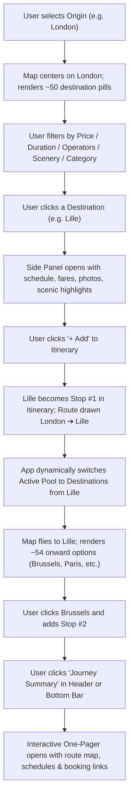

# RailExplore AI — System Architecture & Agent Handoff Documentation

> **Comprehensive Developer & AI Agent Guide**  
> *Last Updated: August 2026*  
> *Application:* **RailExplore AI** (Interactive Pan-European Train Travel Discovery & Multi-City Itinerary Engine)

---

## 1. Executive Summary & Vision

**RailExplore AI** is a modern, high-performance web application designed as the **"Google Flights / Airbnb Explore" for European Rail Travel**. 

Traditional train booking websites (e.g., DB, SNCF, Trainline, Rail Europe) force users to know their exact departure station, exact destination, and exact dates upfront. **RailExplore AI turns this model upside down**:
1. Users select **any departure city in Europe** (e.g., Berlin, London, Paris, Rome, Salzburg, Zurich).
2. The interactive map instantly reveals **all reachable direct and 1-stop destinations**, displaying live price estimates, travel durations, train classes, scenic ratings, and vibes (Alpine Skiing, Coastal Beaches, Romance, History, Wellness, City Breaks).
3. Users can dynamically build **Multi-City Itineraries** (e.g., *London ➔ Lille ➔ Brussels ➔ Amsterdam ➔ Berlin ➔ Prague ➔ Vienna ➔ Munich ➔ Paris ➔ London*), where each added stop seamlessly transforms the map into an onward discovery canvas from that new stop.
4. Users can open an **Interactive Journey Summary (One-Pager)** with route map visualizers, day-by-day train schedules, live booking deep-links, CO2 emissions savings calculations, and print/share features.
5. Users have an integrated **AI Rail Copilot** drawer for conversational travel planning, custom recommendations, and itinerary drafting.

---

## 2. Tech Stack & Architecture Overview

| Layer | Technology / Library | Purpose |
|---|---|---|
| **Framework** | Vue 3 (Composition API `<script setup lang="ts">`) | Modern, performant reactive UI architecture |
| **Language** | TypeScript (Strict mode) | Type safety across deals, filters, itineraries, schedules |
| **Bundler / Dev Server** | Vite 6 | Sub-second HMR and optimized production bundling |
| **Styling & UI** | Tailwind CSS v4 + Lucide Icons | Clean, responsive design language inspired by Google Flights |
| **Mapping Engine** | Leaflet.js (loaded via global CDN) + MapTiler Basic vector raster tiles | Interactive pan/zoom, custom HTML div markers, SVG polylines |
| **Label Collision Engine** | Custom 2D Bounding Box Quadtree / Grid Detector in `MapExplorer.vue` | Prevents map clutter; scales pill density with zoom |
| **Data Graph & Feeds** | 56-Hub Pan-European Rail Graph (`data/multi_origin_rail_network.json`) built from 286,669 GTFS direct routes | Real-time offline-ready transit routing engine |

---

## 3. Data Pipeline & Routing Graph

### 3.1 Raw GTFS & MobilityData Integration
The raw data foundation is generated using:
- **`data/all_direct_routes.json`**: 286,669 direct rail routes extracted from national open GTFS feeds (Deutsche Bahn, ÖBB, SBB, SNCF, PKP, ČD, Renfe, Trenitalia, Eurostar).
- **`scripts/syncMobilityDataFeeds.mjs`**: Ingestion and synthesis script that:
  1. Indexes 56 major European transport hubs across Germany, France, UK, Italy, Spain, Switzerland, Austria, Belgium, Netherlands, Czechia, Poland, Hungary, Denmark, Luxembourg.
  2. Filters out local bus stops, street corners, and transit hubs via `DESTINATION_WHITELIST` (~500 curated cities) and regex exclusion filters (`flughafen`, `airport`, `straße`, `zob`, `p+r`).
  3. Synthesizes high-speed corridors and computes fast 1-transfer connections across European transfer gateways (Paris, Brussels, Amsterdam, Frankfurt, Munich, Zurich, Milan, Vienna).
  4. Calculates distances, approximate ticket fares (accounting for high-speed vs regional), carbon savings ($0.035\text{ kg CO}_2/\text{km}$ vs flights), scenic ratings (1–5), and vibes.
  5. Outputs the indexed graph to `data/multi_origin_rail_network.json` (3.97 MB).

### 3.2 Key Data Files
- **`data/multi_origin_rail_network.json`**: Contains `hubs` array (56 hubs with id, name, country, lat, lng) and `networkByOrigin` map (`Record<hubId, TrainDeal[]>`).
- **`constants.ts`**:
  - `EUROPEAN_HUBS`: Array of all 56 hubs.
  - `getDestinationsForOrigin(originName: string)`: Resolves full destination list with fuzzy matching and geographic fallback.
  - `getOriginCoordinates(originName: string)`: Returns `{ lat, lng }` for any hub name or string.
  - `generateMockSchedules(origin, dest)`: Generates timetable options (Early Bird, Best Choice, Afternoon Express, Evening Starlight) with realistic operators (ICE, TGV, Eurostar, Frecciarossa, Nightjet).

---

## 4. Complete User Flows (Detailed Trace)



### Flow 1: Departure Discovery & Map Exploration
1. User loads the app. Initial origin is `Berlin` (or detected via browser Geolocation `handleGeolocation()`).
2. `searchOrigin` is reactive. `watch(searchOrigin)` resolves `originCoords` and loads `destinations.value = getDestinationsForOrigin(newOrigin)`.
3. `MapExplorer.vue` renders an origin pin at the hub coordinates and renders floating price pills (`$35 Lille`, `$44 Paris`, `$42 Brussels`) over the map.
4. **Collision Avoidance**: On zoom or pan (`mapBounds` / `mapZoom` changes), `updateMarkers()` runs a 2D bounding-box intersection check (`intersects(box, placed)`), ensuring map markers never overlap illegibly.

### Flow 2: Multi-City Itinerary Construction (The Onward Leg Engine)
1. User clicks a destination pill (e.g. **Lille**).
2. The camera smoothly flies to Lille (`mapInstance.flyTo([lat, lng], 6)`).
3. The right-hand **DetailsPanel** (or mobile bottom card) displays the route specifics (duration, train type, CO2 saved, pricing).
4. User clicks **`+ Add`**:
   - `toggleItineraryDestination` adds `Lille` to `itineraryDestinations.value`.
   - `selectedDestinationId` resets to `null`.
   - `searchDestination` and `searchQuery` reset to `'Anywhere'`.
   - `currentPoolDestinations` automatically switches from `destinations.value` (London) to `getDestinationsForOrigin('Lille')` (54 European destinations departing from Lille).
   - `MapExplorer.vue` draws the dashed SVG polyline `London ➔ Lille` with numbered waypoint `[ 1 ] Lille`.
   - `MapExplorer.vue` watcher glides the camera to `Lille` and renders onward destination pills (Brussels, Paris, Antwerp, Amsterdam, London, Cologne, Lyon, etc.).
5. User clicks **Brussels** and clicks **`+ Add`**:
   - Polyline updates to `London ➔ Lille ➔ Brussels` with waypoints `[ 1 ] Lille`, `[ 2 ] Brussels`.
   - Active pool automatically becomes destinations departing from **Brussels**.
6. User can click **`+ Return to London`** in the trip builder bar to cleanly close the loop back to their starting station.

### Flow 3: Journey Summary & One-Pager Export
1. At any point when `itineraryDestinations.length > 0`, the user clicks the prominent **`Journey Summary (N)`** button in the top navigation bar or the floating bottom bar.
2. `ItineraryOnePager.vue` opens as a full-screen modal:
   - **Sequence Badges Flow**: Shows the visual breadcrumb trail `London ➔ Lille ➔ Brussels`.
   - **Interactive Route Map (`ItineraryMap.vue`)**: Renders Leaflet polyline connecting all waypoints with custom numbered pins and auto-fits bounds.
   - **Financial & Environmental Metrics**: Total ticket estimate (e.g. `$58`), total travel time (e.g. `3h 34m`), total $\text{CO}_2$ saved vs flying (e.g. `114 kg`).
   - **Leg-by-Leg Train Schedules**: Detailed timetables for every leg, operator names (Eurostar, TGV, ICE), train numbers, amenities (Wi-Fi, Power, Bistro), and booking deep-links to Virail / Rail Europe.
   - **Share & Print**: Supports 1-click URL sharing and print stylesheets.

### Flow 4: Floating Filter Bar Engine
Over the map sits the floating filter bar (`z-[1200]` with popovers at `z-[2200]`):
- **Stops**: Nonstop Direct only vs All Connections.
- **Price**: Interactive slider from \$10 to \$500+.
- **Duration**: Interactive slider from 1h to 12h+.
- **Operators**: Multi-select filter across High-Speed (`ICE / TGV / RJ / Eurostar`), InterCity (`IC / EC`), Regional (`RE / RB`), Night Trains (`ÖBB Nightjet`), and `FlixTrain`.
- **Scenic**: High scenic rating routes ($\ge 4$ stars) and mountain passes.
- **Night Trains**: Sleeper & Nightjet trains.
- **Reset Button**: 1-click clear when any filter is active.

---

## 5. Component Breakdown & Responsibilities

```
railexplore-ai/
├── App.vue                         # Root orchestrator & global reactive state
├── constants.ts                    # Hubs data, fuzzy routing lookups, schedule generators
├── types.ts                        # Core TypeScript interfaces
├── components/
│   ├── MapExplorer.vue             # Main interactive Leaflet map & collision pill engine
│   ├── DetailsPanel.vue            # Right sidebar route inspector & schedule viewer
│   ├── ItineraryOnePager.vue       # Fullscreen journey summary modal & timetable stream
│   ├── ItineraryMap.vue            # Embedded route map for the One-Pager
│   ├── AiCopilotDrawer.vue         # AI Rail Copilot chat drawer (Gemini prompt ready)
│   └── PriceTrackerModal.vue       # Price tracking subscription modal
├── scripts/
│   ├── syncMobilityDataFeeds.mjs   # Pan-European GTFS processing & network builder
│   └── buildUniversalRailNetwork.mjs
└── data/
    ├── multi_origin_rail_network.json # Compiled 56-hub European transit graph (3.97 MB)
    └── all_direct_routes.json         # 286k raw GTFS direct routes
```

### Component Details:

#### 1. `App.vue`
- **Role**: Master view and state orchestrator.
- **Key State Variables**:
  - `searchOrigin: ref<string>("Berlin")`: Current origin input text.
  - `originCoords: computed<{lat, lng}>`: Geographic coordinates of the origin.
  - `destinations: ref<TrainDeal[]>`: Base destinations from `searchOrigin`.
  - `itineraryDestinations: ref<TrainDeal[]>`: Array of added stops forming the multi-city trip.
  - `activeLegOrigin: computed<string>`: Either the last itinerary stop or `searchOrigin`.
  - `currentPoolDestinations: computed<TrainDeal[]>`: Dynamically selects destinations departing from `activeLegOrigin` (excluding already visited stops).
  - `selectedDestinationId: ref<string | null>(null)`: Selected deal ID (must default to `null` to avoid false automatic camera jumps).
  - `filteredDestinations: computed<TrainDeal[]>`: Applies category, price, duration, operator, scenic, search filters.
  - `filters: ref<FilterState>`: Active filter state object.
  - `isOnePagerOpen: ref<boolean>`: Toggle for Journey Summary.

#### 2. `components/MapExplorer.vue`
- **Role**: High-performance interactive Leaflet map.
- **Key Features**:
  - `updateMarkers()`: Clears and redraws markers based on current viewport bounds and zoom level.
  - Collision avoidance algorithm preventing overlapping price pills.
  - Origin pin marker with custom SVG icon and label.
  - SVG dashed polyline connecting itinerary stops.
  - Numbered waypoint markers `[ 1 ]`, `[ 2 ]`, `[ 3 ]` at each itinerary stop coordinate.
  - Dashed preview line to currently inspected destination.
  - Floating filter bar with elevated z-indexes (`z-[1200]` bar, `z-[2200]` popovers).

#### 3. `components/DetailsPanel.vue`
- **Role**: Detailed sidebar/drawer for destination deep-dive.
- **Key Features**:
  - Destination hero image with fallback handler.
  - Price insight badge (Typical price range, Deal rating).
  - Weather forecast card (temperature, sunny/cloudy icons).
  - Timetable schedule options (Direct ICE/TGV vs 1-transfer).
  - CO2 savings badge and scenic highlight description.
  - **`+ Add to Trip`** action button emitting `@update-itinerary`.

#### 4. `components/ItineraryOnePager.vue` & `components/ItineraryMap.vue`
- **Role**: Print-ready, executive trip summary.
- **Key Features**:
  - Automatically receives `destinations`, `originCoords`, and `originName`.
  - Computes aggregated budget, hours, and carbon metrics.
  - Embeds `ItineraryMap.vue` with auto-fit bounds covering all trip legs.
  - Generates realistic schedules for each consecutive leg.
  - Direct booking links out to European operators.

---

## 6. Critical State Invariants & Rules for Future Agents

> [!IMPORTANT]
> **Rule 1: Never default `selectedDestinationId` to `destinations[0]`**  
> `selectedDestinationId` MUST default to `null`. If set to `destinations[0]`, the map watcher in `MapExplorer.vue` will trigger `flyTo(dest)` on load or origin change, causing unwanted camera jumps (e.g. jumping to Leipzig).

> [!IMPORTANT]
> **Rule 2: Dynamic Pool Switching on Onward Legs**  
> When `itineraryDestinations.length > 0`, `currentPoolDestinations` MUST evaluate `getDestinationsForOrigin(lastStop.destinationName)`. When adding a stop, always reset `searchDestination` and `searchQuery` to `'Anywhere'` so onward routes are not accidentally filtered out.

> [!IMPORTANT]
> **Rule 3: Origin Coordinate Resolution**  
> Always resolve coordinates using `getOriginCoordinates(name)` from `constants.ts` rather than hardcoding `{ lat: 52.52, lng: 13.405 }` (Berlin).

> [!IMPORTANT]
> **Rule 4: Z-Index Layering Hierarchy**  
> Leaflet map panes and controls operate at `z-400` to `z-1000`. To ensure interactive UI elements are never trapped beneath the map canvas:
> - Floating Trip Builder Bar: `z-[1300]`
> - Floating Map Filter Bar: `z-[1200]`
> - Filter Dropdown Popovers: `z-[2200]`
> - Autocomplete Dropdowns: `z-[999]`
> - Details Panel Modal / Drawer: `z-[80]` to `z-[1000]`
> - Journey Summary One-Pager: `z-[1000]`

---

## 7. Development & Operations Guide

### 7.1 Running the Application Locally
```bash
# Install dependencies
npm install

# Start Vite dev server (runs on http://localhost:3000)
npm run dev

# Build production bundle
npm run build
```

### 7.2 Regenerating / Expanding the Rail Graph
To sync new feeds or add additional European hubs/stations:
1. Open `scripts/syncMobilityDataFeeds.mjs`.
2. Add new hubs to `HUBS` array or new cities to `DESTINATION_WHITELIST`.
3. Run the generator script:
   ```bash
   node scripts/syncMobilityDataFeeds.mjs
   ```
4. Verify the output file `data/multi_origin_rail_network.json`.
5. Test the build: `npm run build`.

---

## 8. Extension Points & Future Roadmap

1. **Live GTFS-RT / Booking API Integration**:
   - Connect live pricing and ticket booking via Rail Europe, Trainline Partner API, or DirektBahn API.
2. **AI Copilot Live Tool Calling**:
   - Wire `AiCopilotDrawer.vue` directly to Google Gemini 2.0 Flash / Pro using function calling tools (`search_trains`, `add_stop_to_itinerary`, `filter_scenic_routes`).
3. **Export to Apple Wallet / Google Calendar**:
   - In `ItineraryOnePager.vue`, generate `.pkpass` files or `.ics` calendar events for all booked train legs.
4. **Elevation Profile & Mountain Pass View**:
   - For alpine routes (e.g. Bernina Express, Glacier Express, Arlberg Railway), render an interactive elevation graph along the route polyline.

